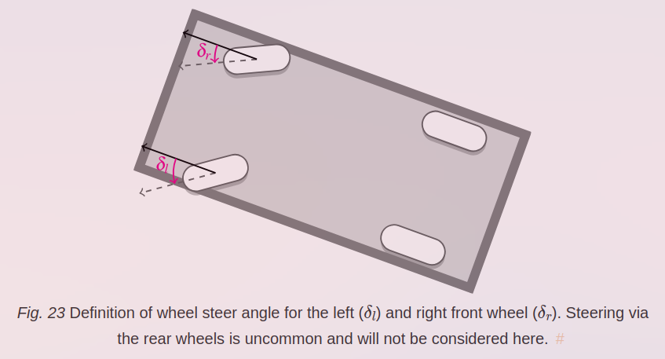
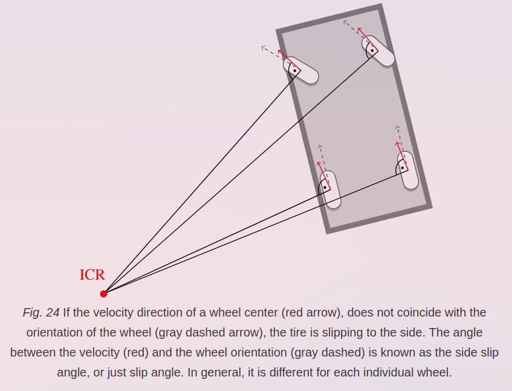
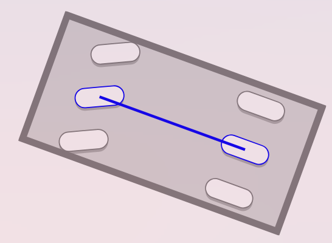
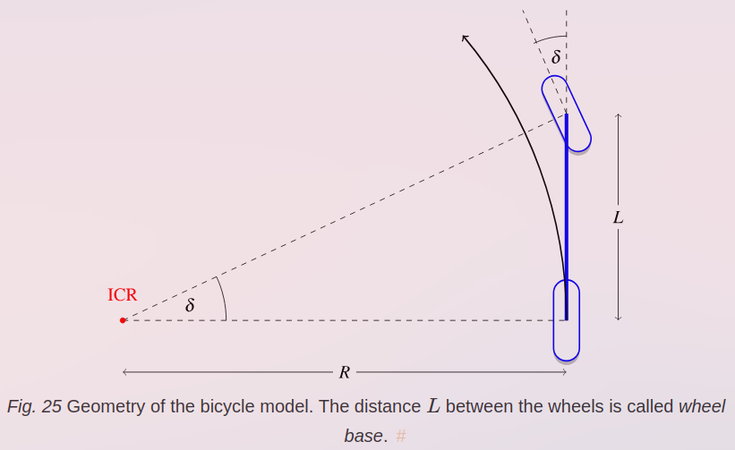
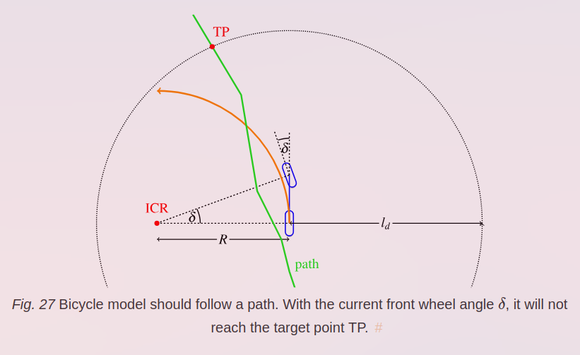
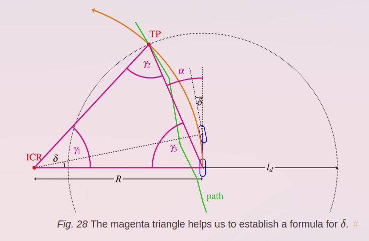

# Checkpoint 2

# Checkpoint 3
## PID Control
The formula:
```math
u(t)=K_pe(t)+K_I\int_0^te(t)dt+K_d\frac{de}{dt}
```

The first term is the proportional, which takes the body to the desired value.
The integral is needed to actually reach the target because the proportional term becomes very close to 0 as the velocity reaches the target. It keeps on adding the errors we have had till now and adds it so that it reaches the target.
The derivative term is needed because it acts like the damping force, preventing oscillations of the velocity about the target velocity.

## Pure Pursuit Steering
### Ackermann Steering



The steering wheel angle is different from the wheel steer angle. The _wheel steer angle_ is the angle of wheels while the _steering wheel angle_ is the angle of the steering wheel. Typically 
`wheel_steer_angle = a*(steering_wheel_angle - b)`
where `a` and `b` are car specific constants and `b` is the steering wheel ofset which should ideally be 0.



In the **kinematic 4-wheel model** all slip angles are assumed=0. Now both rear wheels have same orientation so the ICOR is on the line from both rear wheels. Consider the front wheel steer angles (delta_left , delta right). We need to pick these so that the ICOR is on the line from the rear wheels in such a case we have a Ackermann steering geometry. In general, delta left != delta right.
### Kinetic Bicycle Model 
Pure Pursuit works on a model of the vehicle known as bicycle model.
For the bicycle model, the 2 front wheels and 2 rear wheels are lumped into one.





The kinematic bicycle model is bicycle model + assume all slip angles are 0.

### The control algorithm
The front wheel angle $\delta$ such that the vehicle follow a path,known as lateral vehicle control. You select a target point on the path which is a look ahead distance $l_d$ away from the vehicle. Now the angle $\delta$ is chosen to reach the target acc to the kinematic bicycle model. The look ahead distance is a parameter typically dependant on velocity like $l_d=K_{dd} v$ where $K_{dd}$ needs to be tuned you also have some minimum lookahead distance so $l_d=K_{dd}v+l_{min}$





where alpha is the angle of the target point from the current position.
Calculating, 
```math
\delta=tan^{-1}\left(\frac{2Lsin(\alpha)}{l_d}\right)
```
This is the steer angle required.


